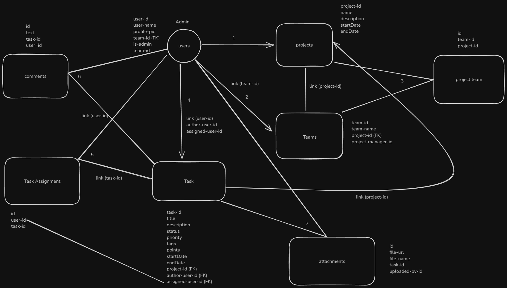
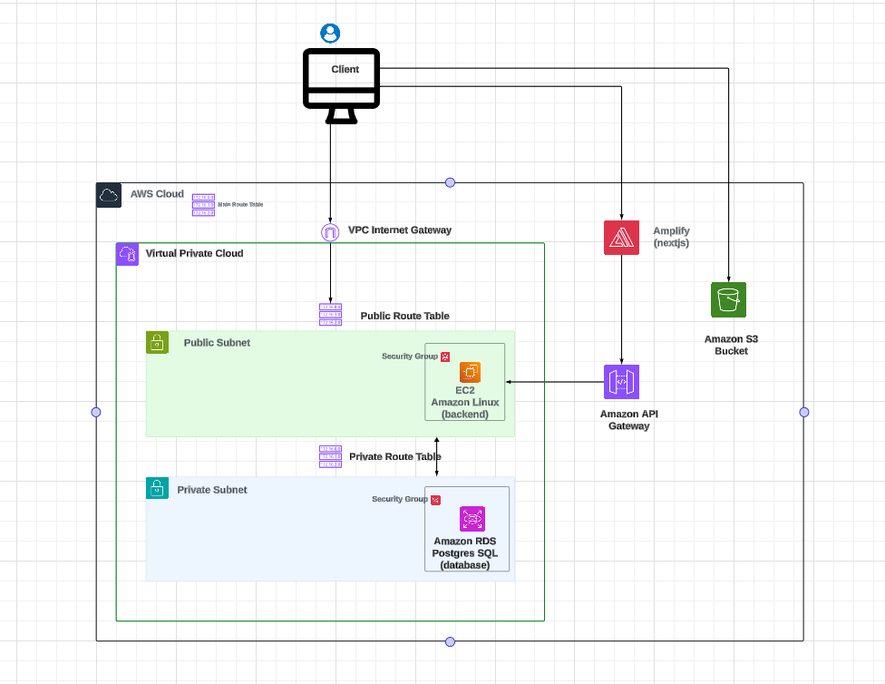

## Project Management Application

Project-Management-Application is a powerful, intuitive project management tool designed to help teams streamline workflows, enhance collaboration, and stay on top of tasks. Whether you're managing a small team or a large-scale project, our app offers a comprehensive suite of features to keep everyone aligned and productive.

### Tech Stack:

Front-end: Next.js, tailwindcss, typescript, axios, react-dnd, react-redux toolkit, mui materials

Backend: node.js, express.js, typescript, postgresql, prisma orm, aws (EC2, S3, RDS, COGNITO)

`libs`

-   `@mui/material @emotion/react @emotion/styled @mui/x-data-grid` : For ui components
-   `lucide-react` : For icons
-   `numeral` : For format numbers
-   `date-fns` : For format dates
-   `axios` : For api calls
-   `recharts` : For charts
-   `react-dnd react-dnd-html5-backend` : For complex drag and drop
-   `gantt-task-react` : Interactive gantt charts

### Flow Diagram Backend

### AWS Architecture Backend

